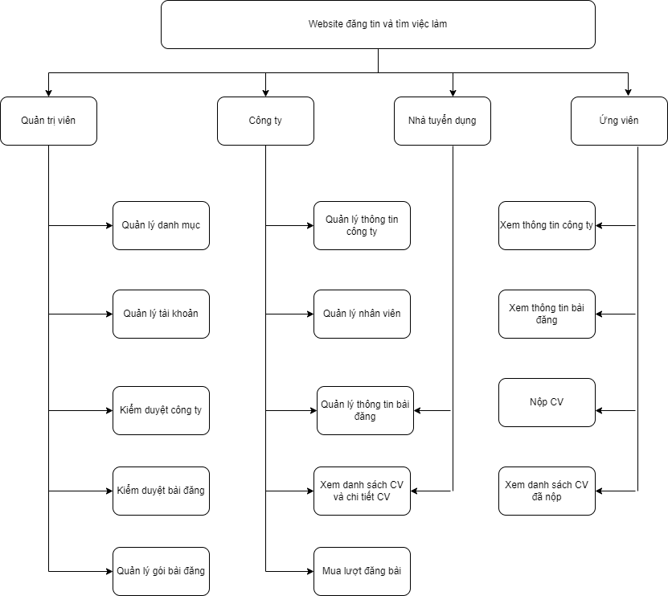

## 🧩 Technologies Used

- Frontend: ReactJS (JavaScript, HTML, SCSS)
- Backend: Node.js (Express Framework)
- Database: MySQL (SQL)
- Development Server: XAMPP
- API: RESTful API (JSON)

# Mô hình chức năng hệ thống tuyển dụng

## 👤 Chức nằng nghiệp vụ

## 👤 Ứng viên

## 🧑‍💼 Nhà tuyển dụng

## 🏢 Công ty

## 🛠️ Quản trị viên
